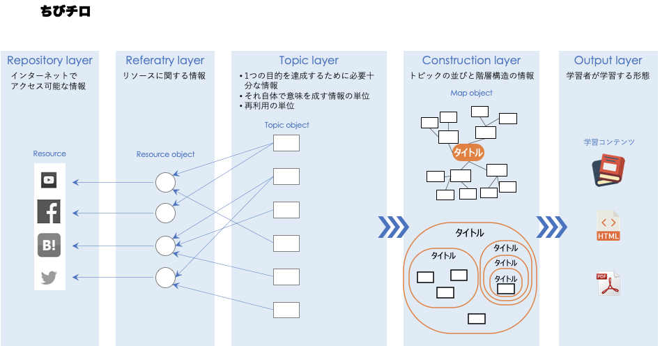

CHiBi-CHiLO 設計文書
==================================================================

この文書は、本システム CHiBi-CHiLO(呼称、ちびちろ)を設計するにあたって考慮した内容と、決定した内容を記録した文書です。

本システムの目的
-----------------------------------------------------------------

本システムは、学習コンテンツをレゴブロックのように組み立てて再利用することを目的とする。
なお本システムで扱う学習コンテンツは動画コンテンツとする．

本システムを構成する概念
----------------------------------------------------------------

学習オブジェクト
~~~~~~~~~~~~~~~~~~~~~~~~~~~~~~~~~~~~~~~~~~~~~~~~~~~~~~~~~~~~~~~~

学習オブジェクト（Learning Object，LO）とは，
組み立て統合し，取り外し，修正し，交換することのできる学習コンテンツの形態で，
それにより，学習コンテンツの制作，修正の労力を節約し，多様化できる．

LOは，学習コンテンツの共有再利用の概念であるが，その定義は，以下のようにさまざまである．

* “さまざまな学習環境での（再）利用を目的に，教育コンテンツを小さなチャンクに分割したもの[ ]”
* “複数の教育コンテキストで，再利用することのできる独立性，自立性の高い学習ユニットである[ ]”
* カプセル化，抽象化，継承，ポリモーフィズムのなど，ソフトウェア開発における「オブジェクト指向」を強く意識したもの
* “any entity, digital or non digital, that can be used for learning, education or training”

本システムのLO
~~~~~~~~~~~~~~~~~~~~~~~~~~~~~~~~~~~~~~~~~~~~~~~~~~~~~~~~~~~~~~~~
3.1.2 フィッシュボーン構造
本システムは，Topic Object（TO），Book Object（BO），Linked Object（LdO）の3種類のLOで構成されている．
同じ種類のLO同士は互いに参照することはなく独立し，LdOはBO参照し，BOはTOを参照するという階層構造をもっている

電子書籍の仕様により，トピックのシーケンシング（順序立て）は次に進む，前に戻るといった線形的になる．
また1冊あたり，講義1回分の学習内容を含み，複数のCHiLO Bookを順に学習することで，一連の学習を終了することとしている．
これは，すなわち，学習リソースがフィッシュボーン構造（図1）をとることになり，1つのCHiLO Bookが終了するまで，次には進まないことを原則とする，ID分野のトピカルシーケンシングと呼ばれるシーケンシングと同様であり，学習者が1つのトピックに徹底的に集中して学習できる，また，次に進む，戻ると言った操作のみなで[ ]，学習しやすさ（learnability）に優れているという長所がある[ ]．

.. _fig概念図:
.. image:: ./_images/image2.png

Micro CHiLOにおいて，実体はリソースレイヤーのOERとアウトプットレイヤーの学習コンテンツのみである．
それ以外は，全てデータセットである．

.. Note::
    プログラマー向けの注釈。OERとLearning Content/学習コンテンツ は、一般ユーザーに認知されているか。であり、Resource Object, Topic Object, Map Object は、本システム内部のデータ構造であり、そのまま一般ユーザに認知されない。あくまでも内部データ構造である。という意味である。

..  uml::

    actor 学習者
    actor 教師
    database VOD
    collections "RO"
    collections "TO"
    collections "BO"
    collections "LdO"
    database LMS
    教師 -> VOD : ビデオファイルのアップロード
    教師 -> TO : 作成
    TO -> RO : 自動登録
    教師-> BO : 作成
    教師-> LMS : 作成
    LMS -> LdO : 自動登録
    学習者 -> LMS : 学習
    LMS -> LdO: 参照（1:1）
    LdO -> BO: 参照（1:1）
    BO -> TO: 参照（n:n）
    TO -> RO: 参照（1:1）
    RO -> VOD : 参照（1:n）

学習者
    教育機関，教師，学生，一般の人々も含めたインターネットにアクセス出来る全ての人.

教師
    教育機関に所属する教師

VOD（Video On Demand）
    ビデオ配信サービス。本システムではWowza,Vimeo,Youtubeに対応している。
    当面，YouTube等で公開されているビデオを対象とする．

TO（Topic Object、トピックオブジェクト）
    リソースオブジェクトとして登録されたOERに，タイトルや解説を追加したデータセット．
    動画ならTimeRange(時間抜きだし)、スライドならページ(範囲)指定、htmlならxpathでの抜き出し、
    WebBundleならその中のファイルパスなど、リソースからトピックの粒度を抜き出す機能を持ち、
    分割されたトピックレベルのメタデータを持つ。
    これがマイクロコンテンツそして，現システムのビデオ，CHiLO Bookの1ページに相当する．
    リソースは当面一部サービスの動画だけ、トピックの分割機能の実装は最初は行わないが、将来単一TimeRangeに対応したい。

BO（Book Object，ブックオブジェクト）
    学習目的を達成するため，トピックオブジェクトを並べ構造化したデータセット．
    トピックの組み合わせ構造(グラフ)とその構造全体に対するメタデータを持ち、構造のサブセットに対する情報や、
    トピック間のrelation(グラフのエッジ)に対するメタデータは当面保有しない。
    しかしサブツリーのルートノードにタイトルくらいないと(文書でいえば章のタイトルがない、コースでいえば講義タイトルがないなど)実用上困るのをどうするか検討(トピックの親ノードにもタイトルだけ付与可能にする？)。
    グラフの形はひとまず単一ルートで深さ有限のツリーだけに対応する。(一般のグラフに対応するとUI的にも利用者の理解的にも無理が生じる恐れがある)その外の構造の対応は需要とコストで随時検討だがある程度経験とデータがたまってから次を見定める。
    深さ有限のツリーはフォルダツリー編集、目次編集のようなUIで実装することでドキュメント編集で直感的に理解しやすくする。
    ある教育機関の案件は深さ三段のツリーであり、ルートがコースにあたるものになる。セクションの追加も踏まえるとまずは4段ツリーの編集画面を用意すると良さそう。
    各種電子書籍を目次や段落で自動分割すればリソースURLの指定から一括トピック生成が可能になる未来がある。その場合などはサブツリーへのメタデータ自動取得もある程度できそう(章のタイトルとか取れる)。トピック、リソース、マップの関係はそういう将来のユースケースを念頭に置く

設計思想
---------------------------------------------------------------------

* 認可は行うが、認証は行わない。

  * `CHiBi-CHiLOのポリシー · Issue #187 · npocccties/ChibiCHiLO <https://github.com/npocccties/ChibiCHiLO/issues/187>`_
  * 認証で同一エンティティを確実に保証するのは、とても大変なシステムになってしまう。具体例としては、NIIのシボレスなど。

