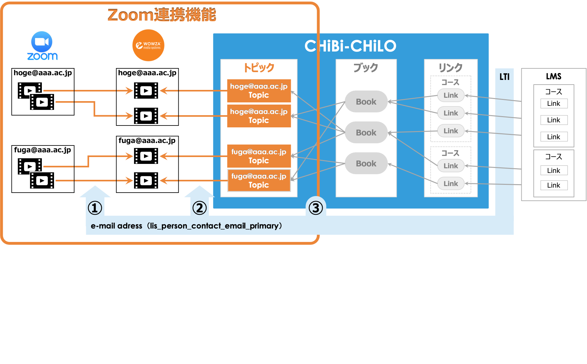

ZOOM連携機能
==================================================================

Zoomでクラウド録画した動画ファイルを，CHiBi-CHiLOのトピックとして自動登録し，LMSで利用する機能である．

ZOOM連携機能の概要
-----------------------------------------------------------------

本機能の概要は次の通り．

ZOOM連携機能の流れ
-----------------------------------------------------------------
本機能の流れは次の通り．

..  uml::

    actor 学習者
    actor 教師
    database VOD
    collections "RO"
    collections "TO"
    collections "BO"
    collections "LdO"
    database LMS
    教師 -> VOD : ビデオファイルのアップロード
    教師 -> TO : 作成
    TO -> RO : 自動登録
    教師-> BO : 作成
    教師-> LMS : 作成
    LMS -> LdO : 自動登録
    学習者 -> LMS : 学習
    LMS -> LdO: 参照（1:1）
    LdO -> BO: 参照（1:1）
    BO -> TO: 参照（n:n）
    TO -> RO: 参照（1:1）
    RO -> VOD : 参照（1:n）

1. Zoom動画をZoom APIを利用してWowzaサーバーに自動複製する．
2. Zoom動画は，Zoomアカウント（メールアドレス）毎に分類されてVODに保管される．
3. VODに登録されたビデオは，メールアドレスをキーにしてCHiBi-CHiLOユーザーごとにトピックとして自動登録される。
4. 教師は自動登録されたトピックを選択しブックを作成し，LMSで提供する．

想定している条件
-----------------------------------------------------------------

* VODは、当面、Wowzaのみを想定しているが将来的にはVimeo等にも拡張できるよう配慮すること．
* Zoomライセンスはアカデミックライセンス，ビジネスライセンス等有料ライセンスを想定している．
* CHiBi-CHiLOにLTIで送信されたメールアドレスと，Wowzaに登録されたZoom動画のメールアドレスを突合し，CHiBi-CHiLOのトピックとして登録する．

CHiBi-CHiLOの改良
-----------------------------------------------------------------

1. CHiBi-CHiLOのユーザーテーブルにはメールアドレスをもうもうける．
2. Zoom録画で作成したトピックはそれがわかるようにアイコン等つける．
3. トピックを容易にMoodleに提供するため，CHiBi-CHiLOのブック作成手順を改良する．
4. トピック一覧画面で，トピックを選択してブックを作成できるようにする．

制限事項（開発概要B）が行われない．
* 上記①のが発生した場合，管理者が手作業にて，所定の場所にZoom動画を複製するなどすることとし，そのための管理機能は開発対象外とする．
* Wowzaに登録されたビデオのアクセス制限は，Wowzaが提供するSecureTokenにより行うことする．そのため，CHiBi-CHiLOのトピックにWowzaのURLを直接記載すると，本人以外のビデオを参照できる．

検討事項
-----------------------------------------------------------------

ZoomのAPIによる動画の複製，削除
~~~~~~~~~~~~~~~~~~~~~~~~~~~~~~~~~~~~~~~~~~~~~~~~~~~~~~~~~~~~~~~~
* Zoom APIによるクラウド録画へのアクセスは，管理者アカウントで可能か
* 管理者アカウントで行うことで，工数の節約ができるか
* 複製した後のZoomクラウドにのこされた動画ファイルを削除すべきか
* 削除しない場合は，同じ動画ファイルを重複して複製することをどう防ぐか

自動登録のタイミング
~~~~~~~~~~~~~~~~~~~~~~~~~~~~~~~~~~~~~~~~~~~~~~~~~~~~~~~~~~~~~~~~
Zoom動画動画のVODへの自動複製，VODからトピックの自動登録はどのようなタイミングでおこなうのか

* 何らかのイベントをハックする
*	ユーザーがCHiBi-CHiLOにアクセスし，Zoomデータを取得する，等のアクションを行う
* バッチ等で定期的に行う

複数のLMSからのCHiBi-CHiLOにアクセスした場合のユーザー突き合わせへの応用
~~~~~~~~~~~~~~~~~~~~~~~~~~~~~~~~~~~~~~~~~~~~~~~~~~~~~~~~~~~~~~~~

* CHiBi-CHiLOのユーザーテーブルにメールアドレスを記録することで，メールアドレスでユーザーを付き合わせることで，複数のLMSからCHiBi-CHiLOのリソースにアクセスできるようになるのではないか．

