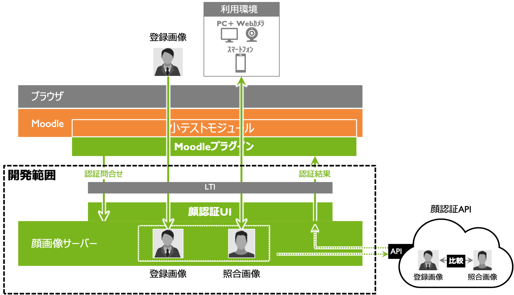

顔認証
==================================================================

概要
-----------------------------------------------------------------
想定している顔認証システムは， Moodleプラグイン，Webカメラ制御プログラム，顔画像サーバーから構成される（図1）．
本開発の範囲は図1のうち顔画像サーバー部分とする．

図1：顔認証システム概要

1. 修了試験は，Moodleの標準モジュールである小テストモジュールを利用する．
2. Moodleプラグインは，Moodle小テストモジュールに対するアクセスを制御する．
3. Webカメラの制御は， Web制御プログラムによりWebブラウザが行う．また，顔認証は，別途設置する顔画像サーバーにより提供する．
4. 顔画像サーバーはMoodleプラグインから，教育ITの標準規格であるIMS LTI （以下，LTI）で呼び出され，外部の顔認証APIに画像の比較を依頼し，その結果を受け取ってLTIにて顔認証結果をMoodleに返す．

顔認証システムの処理について
-----------------------------------------------------------------
想定している顔認証システムの処理を図2に示す．

.. image:: ./_images/image5.png
図2： 顔認証システムのプロセス

顔画像サーバーの処理
~~~~~~~~~~~~~~~~~~~~~~~~~~~~~~~~~~~~~~~~~~~~~~~~~~~~~~~~~~~~~~~~

本開発範囲である顔画像サーバーの処理は以下の通りである．
1. MoodleプラグインからLTIにより受講者ID等の学習者の属性情報を受け取る．
2. 登録画像がなければ，登録を求める．
3. Webカメラ制御プログラムからカメラ画像を照合画像として，受け取る．
4. 学習者のIDを手がかりにして顔画像データーベースから登録画像を取り出しカメラ画像と共に顔認証APIに送信し，顔認証の問い合わせを行う．
5. 顔認証APIの問合せ結果を，LTI経由で，Moodleプラグインに返す．
6. 認証結果を，受講者ID，講習ID，照合画像，タイムスタンプと共に顔データベースに記録する．

Moodleプラグインの処理
~~~~~~~~~~~~~~~~~~~~~~~~~~~~~~~~~~~~~~~~~~~~~~~~~~~~~~~~~~~~~~~~

Moodleプラグインの処理を参考までに記載する．
Moodleプラグインでは顔認証機能等を実装せず，小テストモジュールと顔画像サーバーの通信を以下のように媒介する．

1. Moodleの小テストモジュールにて，試験が開始されると，Moodleプラグインが呼び出される．
2. Moodleプラグインは，Webカメラ制御プログラムを呼び出し，カメラ画像の撮影を依頼する．その後，カメラ画像はWebカメラ制御プログラムが直接顔画像サーバーに渡すため，Moodleプラグインはカメラ画像の送受信に関与しない．
3. Moodleプラグインは，顔画像サーバーに対して，LTIプロトコルにて接続します．LTIの機能により，学習者がMoodleにログインしていると，受講者ID，講習IDなどの情報が顔画像サーバーに渡る．
4. 顔画像サーバーが認証の可否をMoodleプラグインに伝える．
5. Moodleプラグインは，認証結果の成功を受け取ると，Moodle小テストモジュールに学習者のアクセス許可を与える．失敗した場合には，テスト開始時には，再度の認証を要求し．試験実施中は認証結果が失敗していても再認証は要求しない． 

Webカメラ制御プログラムの処理
~~~~~~~~~~~~~~~~~~~~~~~~~~~~~~~~~~~~~~~~~~~~~~~~~~~~~~~~~~~~~~~~

Webカメラの制御は，Webブラウザから行うこととし，開発ツールとしてWebRTCを利用する． 
1. webカメラ制御プログラムは，Moodleプラグインからカメラ画像の撮影依頼を受け取る．
2. Webでカメラ撮影を実施する．
3. 撮影されたカメラ画像を顔画像サーバーに送信する．

エラー処理
~~~~~~~~~~~~~~~~~~~~~~~~~~~~~~~~~~~~~~~~~~~~~~~~~~~~~~~~~~~~~~~~
以下のエラー処理を行うことを想定している．なお，この処理は，小テストモジュールが最初に認証を求めた時点（試験の開始時）でのみ行う．

1. 顔認証に失敗し，試験が開始できないというエラーを返す．
2. 正しい位置でカメラに向かうようアラートを表示する．
3. 上記②のアラートを特定回数表示し，それでも認証されない場合は，顔画像の再登録申請をするか問い合わせるアラートを表示する

検討事項
-----------------------------------------------------------------

•	Webカメラ制御プログラムの開発を行わず，顔認証サーバーの開発がおこなえるのか
•	開発範囲として，エラー処理の配慮まで必要なのか
•	LTIプロトコル対応に開発工数は発生するのか

